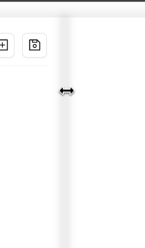
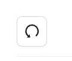

# Awesome text editor

Used technologies:
  * TypeScript/React
  * MobX
  * Ant Design
  * HTML/SCSS (css-modules)
  * Webpack

## About app

1. The page contains a sidebar and a text editing window:
    - Sidebar resizes

    

    - Text editor fills the remaining space
2. Sidebar supports next actions:
    - add new element (adds new element to active folder or in top level if no folder is selected)

    

    - save all created tree of elements to local storage

    

    - reset button returns the tree to the previous saved state (all states are stacked in local storage)

    

3. Context menu:
    - on folder element allows to add, edit or delete element
    - on file element - edit or delete element
4. Other features:
    - service for managing local storage state
    - custom function to combine class names
5. To be added and improved:
    - drag and drop
    - apply antd form to manage state of fields in modal - validate values, disable form elements, show hints.
    - support of multiple open tabs with text content
    - text formatting
    - authorization

## Available Scripts

In the project directory, you can run:

### `npm i`

To install and use project locally.

### `npm run start`

And open [http://localhost:3000](http://localhost:3000) to view it in the browser.
